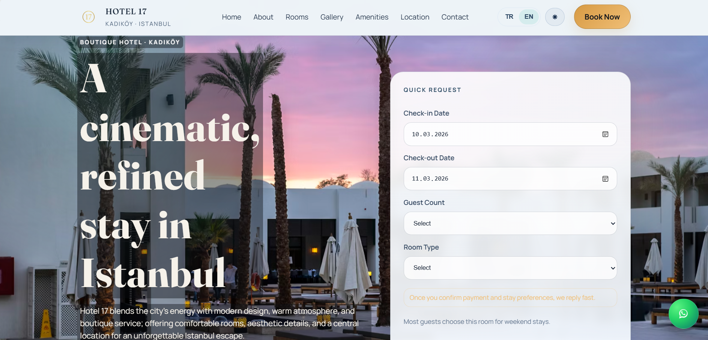

# 🏨 Hotel 17

### Boutique Hotel Landing • Premium Design • Interactive Experience

A modern **boutique hotel website** designed to showcase rooms, atmosphere, and guest experience through a **premium interactive interface**.

🌐 **Live Demo**  
https://YOUR-DEMO-LINK

---

# ✨ Overview

**Hotel 17** is a modern boutique hotel landing page designed to present hospitality services through an elegant and immersive interface.

The website focuses on delivering:

• premium visual design  
• interactive user experience  
• smooth transitions and animations  
• responsive layout across all devices  

The project demonstrates how a **luxury hospitality website can be built using pure frontend technologies**.

---

# 🚀 Features

## 🏨 Room Showcase

The website presents multiple room types with detailed information.

Each room includes:

• room description  
• capacity information  
• bed type  
• amenities list  
• image gallery  

Room details open inside a **dynamic modal interface**.

---

## 🖼 Gallery Lightbox

Guests can explore the hotel atmosphere through an interactive gallery.

Features include:

• fullscreen image viewer  
• next / previous navigation  
• image captions  
• smooth transitions  

---

## 📩 Booking Request UX

The website includes a **quick booking request form** designed to simulate a hotel inquiry system.

Features include:

• check-in / check-out selection  
• guest number selection  
• room type selection  
• interactive status messages  

---

## 🌙 Light / Dark Mode

The interface supports **dynamic theme switching**.

Features include:

• dark theme  
• light theme  
• automatic system preference detection  
• stored user preference  

---

## 🌐 Multi-language Support

The interface supports multiple languages.

Currently available:

• Turkish  
• English  

Texts are managed through a **JSON-based translation system (i18n)**.

---

## 📱 Fully Responsive Layout

The website adapts smoothly to different screen sizes.

Supported devices:

• desktop  
• tablet  
• mobile  

The mobile version includes a **custom mobile navigation menu**.

---

## 🎨 Premium UI Design

The visual design is inspired by **modern boutique hotel websites**.

Design elements include:

• elegant serif typography  
• gold accent color palette  
• cinematic hero section  
• soft lighting overlays  

---

# 🖼 Interface Preview

---

# 🛠 Tech Stack

| Technology | Purpose |
|-----------|--------|
| HTML5 | Page structure |
| CSS3 | Styling and layout |
| JavaScript | Interactivity and UI logic |

---

# 📂 Project Structure
Hotel17
│
├── index.html
├── style.css
├── script.js
├── i18n.json
│
├── preview.png
└── README.md

---

# 🎯 Project Purpose

This project was created to:

• design a modern boutique hotel website  
• practice advanced UI styling with CSS  
• implement interactive UI components using vanilla JavaScript  
• build a portfolio-ready hospitality web project  

---

# 🔮 Future Improvements

Possible improvements include:

• real reservation system integration  
• availability calendar  
• payment system integration  
• hotel management CMS panel  
• advanced SEO optimization  

---

# 👩‍💻 Developer

**Berfin Nida Öztürk**

GitHub  
https://github.com/berfinida

LinkedIn  
https://www.linkedin.com/in/berfin-nida-%C3%B6zt%C3%BCrk-6a12131b7/

---

# 📄 License

MIT License
